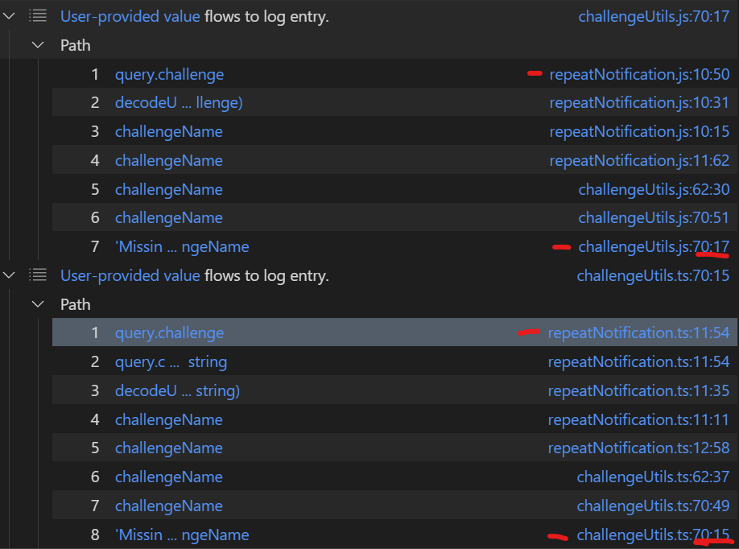

# SAST analysis
In this project I'll analyze the functionality of Semgrep, codeQL and Joern on Juiceshop.

## Setting up a codeQL-DB of the Juice-Shop app
0. Install CodeQL.
1. `git clone https://github.com/juice-shop/juice-shop.git --depth 1 && cd juice-shop && npm install`
2. `mkdir ../codeqldb && codeql database create ../codeqldb --language=javascript`
3. `mkdir ../codeql-queries && cd ../codeql-queries && got clone https://github.com/github/codeql.git`

## Work Log
### codeQL
1. We're interested in running the queries at: `codeql-queries/codeql/javascript/ql/src/Security`.
2. Running some of them seeems really interesting, specifically - CWE-117, CWE-313, CWE-598, CWE-798.
3. Need to run and manipulate ALL the queries, options are: "exec"-style, find a way to analyze results in code (API?).
    - Running queries is very friendly when you just want to check some of them, running a bunch of them will require handling a configuration file, and that's before talking about what queries shoud you choose.
    - Didn't find a way to analyze results by the code (API).
    - Results are shown, but they're not aggregated in any way, for example: The following are 2 paths that are the result of a log-injection query by codeQL:
    

### Semgrep
1. Still checking but - Semgrep __does__ provide an API, I think yhey expect a Semgrep to run locally (or remotely, in a known route) and then we can make requests and [get results in JSON format](https://semgrep.dev/api/v1/docs/#tag/Finding).
2. You need to install Semgrep locally: https://semgrep.dev/docs/getting-started/
3. Then, you need to **manually** deploy the project and run a scan on the specified repo, specfically - simply follow the steps here: https://semgrep.dev/orgs/-/setup/local
4. Then you'll be able to recieve and parse the findings via a simple GET request, see the API documentation here: https://semgrep.dev/api/v1/docs/#tag/Finding (after getting an authentication token via another GET request, doc on the same page).

## TODO List
1. Run codeQL security queries on the DB and parse paths.
2. Set up Semgrep. __[WE ARE HERE]__
3. Run Semgrep security queries on the app and parse paths.
4. Set up Joern.
5. Run Joern security queries on the app and parse paths.
6. For each service - Understand the "ease of use" of the query language" and the flexibility of the DB (expressiveness power?).
7. Run TreeSitter on the app and thoroughly analyze the output.
8. Extra: Same for AWSGoat.